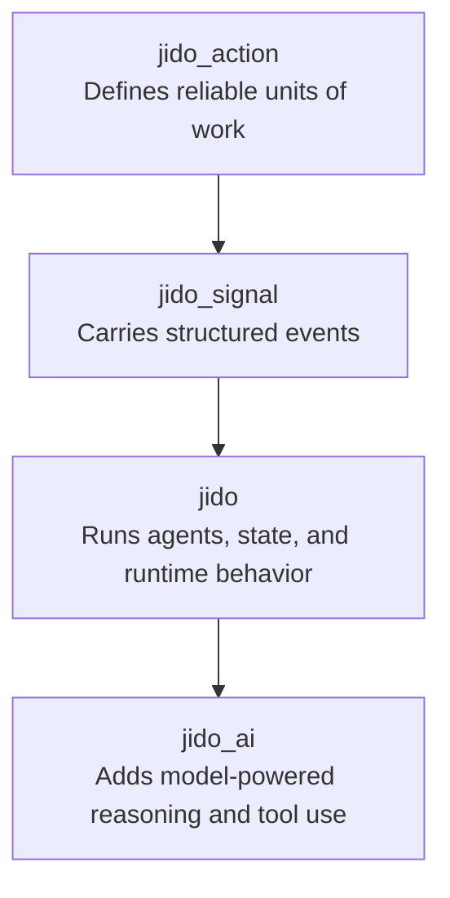
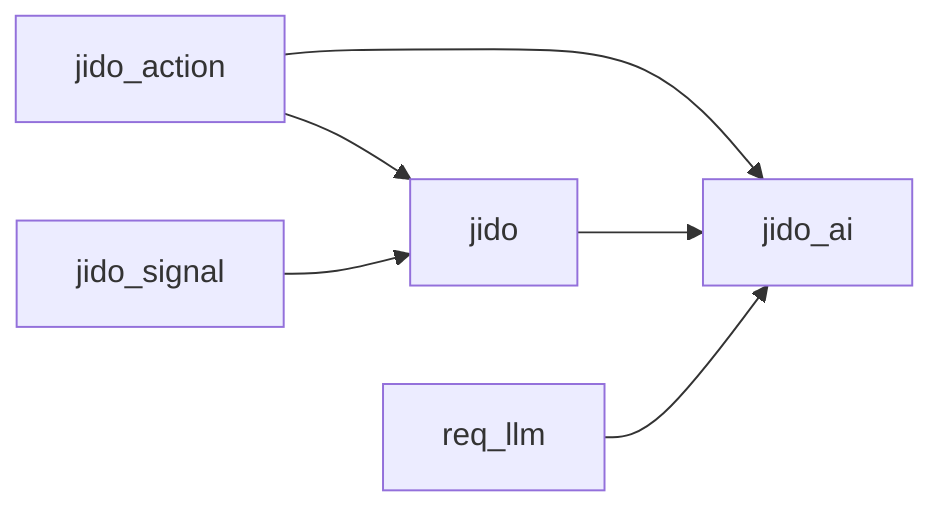

# Lesson 00: Ecosystem Map

## What This Lesson Is For

This first lesson is here to make the rest of the series feel calm.

Before we build anything, we want a simple answer to a simple question:

What belongs where in the Jido ecosystem?

If we skip that step, every later lesson feels heavier than it needs to. The names start to blur together. The packages sound similar. And it becomes easy to wonder whether we are learning four separate tools or one layered system.

The good news is that the ecosystem becomes much easier to understand once we meet the pieces in the right order.

In this lesson, we will not write code.

Instead, we will build a mental map.

By the end, you should be able to say:

- what `jido_action` is responsible for
- what `jido_signal` is responsible for
- what `jido` is responsible for
- what `jido_ai` is responsible for
- why they are easier to learn in that order

Estimated pace: about 15 minutes as a spoken walkthrough.

## The Big Idea

Jido is not really four unrelated packages.

It is better to think of it as a stack that grows outward.

We start with the smallest thing we can trust.
Then we connect those small things.
Then we give them a runtime to live in.
Then, only after that, we give the system AI capabilities.

That order matters.

If we start with AI first, everything feels magical and hard to reason about.
If we start with actions first, everything feels grounded.

So our path through the ecosystem will be:

1. `jido_action`
2. `jido_signal`
3. `jido`
4. `jido_ai`

That is not just a teaching choice.
It is also the shape of the stack itself.

## Start Small: `jido_action`

The first layer is `jido_action`.

This package is about a very basic question:

How do we describe one piece of work clearly?

Imagine you are building a system that needs to do things like:

- validate a form
- fetch data from an API
- write a file
- calculate a result
- transform some input into an output

You can do all of that with ordinary functions. But over time, ordinary functions can become hard to inspect, hard to validate, and hard to reuse safely.

`jido_action` says: let us give each unit of work a shape.

Instead of thinking, "I have some code that does something," you start thinking, "I have an action with a name, an input, an output, and a clear purpose."

That shift is small, but it changes a lot.

Now each action can be:

- described
- validated
- tested
- composed with other actions
- reused as a tool later

This is why we start here.

Before we talk about agents, events, orchestration, or AI, we want to become comfortable with one reliable building block: a clearly defined action.

### In plain words

`jido_action` is the layer for small, trustworthy jobs.

It helps us answer:

"What is one thing my system knows how to do?"

## Then Add Movement: `jido_signal`

Once we have actions, the next question is not "How do we make them smarter?"

It is:

"How do parts of the system talk to each other in a clean way?"

That is where `jido_signal` comes in.

Signals are messages, but not loose, messy, mysterious messages.
They are structured messages.

They carry meaning.
They can be traced.
They can be routed.
They can be replayed.

This package gives the ecosystem an event and communication layer.

That means when something happens, we can describe that event in a way that is visible and organized. A signal can tell us what happened, where it came from, and where it should go next.

This matters because systems become difficult long before they become "intelligent."
They become difficult when information starts moving between parts.

`jido_signal` gives that movement a shape.

Now we are no longer dealing only with isolated actions.
We are dealing with actions inside a living system, where events travel and trigger responses.

### In plain words

`jido_signal` is the layer for meaningful communication.

It helps us answer:

"How does the system say that something happened?"

## Then Add a Home: `jido`

Now we have two useful things:

- work that has a clear shape
- messages that have a clear shape

The next question is:

"Where does all of this live?"

That is the role of `jido`.

`jido` is the runtime layer.
It is where agents live, keep state, react to inputs, and produce effects in a disciplined way.

You can think of it as the place where the earlier pieces come together into behavior.

An agent in Jido is not just a chatbot or an AI persona.
At this stage, it is better to think of an agent as a stateful actor with responsibilities.

It receives something.
It decides what to do.
It updates its own state.
It may emit directives for side effects.

This is why `jido` comes after `jido_action` and `jido_signal`.

If we start with the runtime too early, it can feel abstract.
But once we already understand actions and signals, the runtime suddenly makes sense:

- actions are the work the system knows how to do
- signals are the events moving through the system
- Jido is the place where stateful behavior coordinates both

### In plain words

`jido` is the layer for running a real agent system.

It helps us answer:

"Who owns the state, and how does the system decide what happens next?"

## Finally Add Intelligence: `jido_ai`

Only now do we arrive at `jido_ai`.

This is a very important moment in the learning path.

Many people would expect AI to be the first topic.
In this tutorial series, it is intentionally the last layer.

Why?

Because `jido_ai` makes much more sense when it feels like an extension of a system we already understand.

By the time we reach this layer, we already know:

- how work is defined
- how events move
- how runtime behavior is organized

Now AI can enter the picture in a stable way.

`jido_ai` is the package that adds model-powered reasoning, tool use, request handling, and strategy choices on top of the earlier layers.

It does not replace the rest of the stack.
It depends on the rest of the stack making sense first.

That is why the summaries described it as sitting on top of `jido`, `jido_action`, and `req_llm`.

In other words:

- `jido_action` gives AI safe tools
- `jido_signal` gives AI-visible events and lifecycle flow
- `jido` gives AI a runtime and an agent model
- `jido_ai` adds reasoning and model interaction on top

### In plain words

`jido_ai` is the layer for AI-powered behavior.

It helps us answer:

"How do we let this system think, choose tools, and work with language models without losing structure?"

## The Ecosystem As a Story

Here is the same idea in story form.

First, we teach the system how to do one small job.

Then, we teach the system how to talk about what is happening.

Then, we give the system a place to hold state and coordinate behavior.

Then, and only then, we let the system use AI.

This is the emotional center of the whole series:

AI is not the foundation.
AI is the top layer of a well-shaped system.

That mindset will save us a lot of confusion later.

## Architecture Diagram

This is the simplest map of the stack:

Read it from bottom to top in terms of capability, or from top to bottom in terms of learning order.

Either way, the message is the same:

each layer makes the next one safer and easier to understand.

## Dependency Map

Here is the practical dependency picture we will use in this tutorial series:

This diagram is intentionally simple.

It tells us two helpful things:

1. `jido_action` is foundational more than once.
2. `jido_ai` is not a standalone island. It stands on lower layers.

## A Simple Way to Remember the Four Packages

If you want a short memory trick, use this:

- `jido_action` = work
- `jido_signal` = communication
- `jido` = runtime
- `jido_ai` = intelligence

That is not the full technical truth, but it is a very good first map.

And for a first lesson, a good map matters more than a perfect one.

## Why This Order Builds Well

Let us say the series started with `jido_ai`.

You would immediately run into a lot of invisible questions:

- What is a tool?
- Where does that tool come from?
- How does the system know what happened after a tool ran?
- Where does agent state live?
- How are effects described?

Those are not AI questions.
They are foundation questions.

So the order of the series is designed to remove mystery layer by layer.

### Layer 1

Learn how to define one unit of work.

### Layer 2

Learn how systems communicate about work.

### Layer 3

Learn how stateful behavior is organized around that work.

### Layer 4

Learn how AI fits into the already-structured system.

This is what we mean by evolutive discovery.

We are not just covering topics.
We are letting one concept create the need for the next one.

## Small Exercise

Take five minutes and do this on paper or in a notes file.

### Exercise Prompt

You are building a simple support assistant for a small team.

It needs to:

- look up an answer from a known source
- tell the rest of the system that a question arrived
- keep track of the current conversation
- optionally use a language model to draft a reply

Match each responsibility to one package:

- defining the lookup operation
- announcing that a new question arrived
- holding the conversation state
- drafting the reply with a model

### Expected Mapping

- defining the lookup operation -> `jido_action`
- announcing that a new question arrived -> `jido_signal`
- holding the conversation state -> `jido`
- drafting the reply with a model -> `jido_ai`

### Deliverable

Create your own tiny version of the ecosystem map using four boxes and arrows.

If you want, use this exact sentence format:

- "This package owns the work."
- "This package owns the communication."
- "This package owns the runtime."
- "This package owns the intelligence layer."

That simple diagram is enough for this lesson.

## What You Should Walk Away With

If this lesson worked, you should now feel that the ecosystem is layered, not crowded.

You do not need to know the internals yet.
You only need to know what kind of responsibility lives in each package.

Here is the final summary:

- `jido_action` defines reliable work
- `jido_signal` moves meaningful events
- `jido` runs stateful agent behavior
- `jido_ai` adds AI reasoning on top of that system

## What Comes Next

The next lesson will move from the map to the playground.

We will create a local working setup where all future lessons can live.
That gives us a safe place to experiment without trying to understand the whole stack at once.

For now, this is enough:

we know the terrain, and we know the order in which we are going to explore it.
